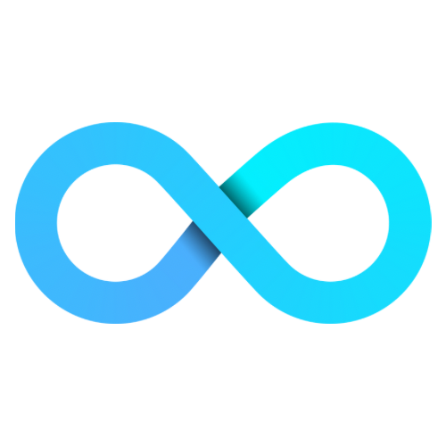

<div align="center">

# 🚀 My DevOps Portfolio
### The Interactive CI/CD Experience


<br />

**A unique portfolio that treats your career journey as a continuous integration pipeline.**

[Live Demo](https://edensitko.github.io/devops-portfolio/) · [Report Bug](#) · [Request Feature](#)

</div>

---

## 📖 About The Project

<div align="center">
  
</div>

This isn't just another static portfolio. It's a **fully interactive experience** designed for the modern DevOps engineer. Built with the latest web technologies, it visualizes the Software Development Life Cycle (SDLC) as a navigable journey.

Visitors don't just scroll—they **flow** through the stages of:
`Plan` ➔ `Code` ➔ `Build` ➔ `Test` ➔ `Release` ➔ `Deploy` ➔ `Operate` ➔ `Monitor`

### ✨ Key Features

*   **🔄 Interactive DevOps Loop**: A central navigation hub representing the infinity loop of DevOps.
*   **⚡ Dynamic Animations**: Powered by Framer Motion for glassy, smooth transitions.
*   **🛠️ Tech Stack Visualization**: See skills and tools integrated directly into the `Code` and `Build` stages.
*   **📊 Live Monitoring Dashboard**: A simulated `Monitor` stage showing "system metrics" (your activity).
*   **🚀 Automated Deployments**: Watch projects "deploy" in real-time in the `Deploy` stage.
*   **📱 Fully Responsive**: Optimized for desktop command centers and mobile monitoring.

---

## 🛠️ Built With

*   **Framework**: [Next.js 16](https://nextjs.org/) (React 19)
*   **Styling**: [Tailwind CSS](https://tailwindcss.com/)
*   **Animation**: [Framer Motion](https://www.framer.com/motion/)
*   **Icons**: [Lucide React](https://lucide.dev/)
*   **Contact**: [EmailJS](https://www.emailjs.com/)

---

## 🚦 Navigation Guide

The portfolio is structured around the 8 stages of DevOps:

| Stage | Component | Description |
| :--- | :--- | :--- |
| **📝 Plan** | `PlanStage.tsx` | Architecture diagrams & project roadmaps. |
| **💻 Code** | `CodeStage.tsx` | Technical skills, languages, and tools. |
| **🏗️ Build** | `BuildStage.tsx` | CI pipeline visualization & build logs. |
| **🧪 Test** | `TestStage.tsx` | Quality assurance & testing methodologies. |
| **📦 Release** | `ReleaseStage.tsx` | Version history & release notes. |
| **🚀 Deploy** | `DeployStage.tsx` | **Project Showcase** - View deployed apps. |
| **⚙️ Operate** | `OperateStage.tsx` | Certifications & operational experience. |
| **📈 Monitor** | `MonitorStage.tsx` | Real-time dashboard & contact stats. |

---


## 📂 Project Structure

```bash
devops-portfolio/
├── public/              # Static assets (images, CV, icons)
├── src/
│   ├── app/             # App Router pages & layouts
│   ├── components/
│   │   ├── stages/      # The 8 core stage components
│   │   ├── DevOpsLoop.tsx      # The central navigation loop
│   │   ├── DevOpsPipeline.tsx  # Main orchestrator
│   │   └── WelcomeModal.tsx    # Intro screen
└── ...
```

---

## 🎨 Customization

Want to make it your own?

*   **Projects**: Edit `src/components/stages/DeployStage.tsx`.
*   **Skills**: Update `src/components/stages/CodeStage.tsx`.
*   **Bio/Certifications**: Modify `src/components/stages/OperateStage.tsx`.

---

## 📄 License

Distributed under the MIT License. See `LICENSE` for more information.

---

<div align="center">
  <p>Built with ❤️ by Eden Sitkovetsky</p>
  <p>
    <a href="https://github.com/yourusername">GitHub</a> · 
    <a href="https://linkedin.com/in/yourusername">LinkedIn</a>
  </p>
</div>
